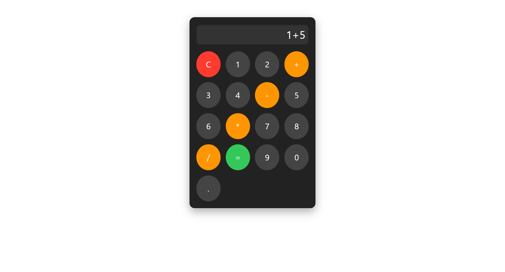

# React Calculator App

A simple calculator built using **React** and **CSS Modules**. This project demonstrates:

- Component-based architecture
- State management with `useState`
- Event handling
- Responsive UI with CSS Modules

---

## 📸 Project Screenshot



---

## 🚀 Features

- Add, subtract, multiply, divide operations
- Clear screen (C button)
- Real-time calculation display
- Modular and reusable components
- Styled using CSS Modules

---

## 🛠 Tech Stack

- **React JS**
- **CSS Modules**
- **JavaScript (ES6+)**

---

## ▶️ How to Run Locally

1. **Clone the repo**
   ```bash
   git clone https://github.com/your-username/react-calculator-app.git
   ```
